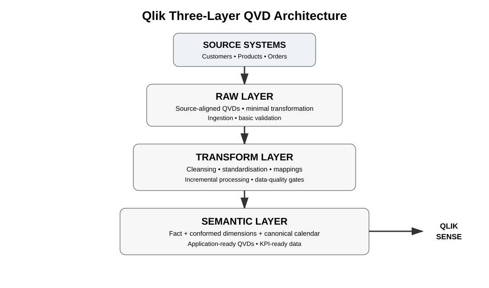

# Qlik QVD Architecture Lab

[](https://github.com/SanAkhGIT/qlik-qvd-architecture/actions/workflows/validate.yml)

A production-style portfolio demonstration of a **three-layer QVD architecture** using deterministic synthetic sales data.

The project separates source ingestion, reusable transformation, data-quality controls and application-ready semantic data into explicit layers.

> **Portfolio project:** synthetic data only. No proprietary client data, scripts or internal architecture are included.

## Architecture



```text
                 ┌──────────────────────┐
                 │ Synthetic CSV Source │
                 └──────────┬───────────┘
                            │
                            ▼
                 ┌──────────────────────┐
                 │  RAW QVDs            │
                 │  source-aligned      │
                 └──────────┬───────────┘
                            │
                            ▼
                 ┌──────────────────────┐
                 │  TRANSFORM QVDs      │
                 │  cleanse / validate  │
                 └──────────┬───────────┘
                            │
                  ┌─────────┴─────────┐
                  ▼                   ▼
        ┌──────────────────┐   ┌──────────────────┐
        │ Data Quality Gate│   │ Incremental Load │
        └────────┬─────────┘   └────────┬─────────┘
                 └──────────┬───────────┘
                            ▼
                 ┌──────────────────────┐
                 │  SEMANTIC QVDs       │
                 │  fact + dimensions   │
                 └──────────┬───────────┘
                            ▼
                 ┌──────────────────────┐
                 │    Qlik Sense App    │
                 └──────────────────────┘
```

## What this demonstrates

- Three-layer QVD architecture
- Source-aligned Raw ingestion
- Reusable Transform QVDs
- Declared fact grain and star-style semantic model
- Incremental loading using `ModifiedTimestamp` and a look-back window
- Data-quality gates and audit metrics
- Conformed dimensions and a canonical calendar
- Avoidance of unnecessary joins and synthetic keys
- Separation of technical and business logic
- Git-based source control
- Automated validation with GitHub Actions

## Repository Structure

```text
qlik-qvd-architecture/
├── .github/workflows/validate.yml
├── architecture/
│   └── architecture.svg
├── config/
│   ├── environment.qvs
│   └── environment.local.example.qvs
├── data/sample/
│   ├── customers.csv
│   ├── products.csv
│   ├── orders.csv
│   └── README.md
├── docs/
│   ├── data-modelling.md
│   ├── data-quality.md
│   ├── dashboard.md
│   ├── incremental-loading.md
│   ├── interview-defence.md
│   └── performance.md
├── python/
│   └── generate_data.py
├── qlik/
│   ├── 00_master_reload.qvs
│   ├── 01_raw.qvs
│   ├── 02_transform.qvs
│   ├── 03_semantic.qvs
│   ├── 04_incremental_orders.qvs
│   ├── 05_data_quality.qvs
│   ├── 06_app_load.qvs
│   └── README.md
├── qvd/
│   └── .gitkeep files define the intended output folders
├── tests/
│   ├── validate_source_data.py
│   └── README.md
└── README.md
```

## Data Model

### Fact

**FactOrders** — one row per `OrderID` after validation/deduplication.

Fields include order date, customer, product, quantity, discount, sales amount and modification timestamp.

### Dimensions

**Customers** — customer, region, country and segment.

**Products** — product, category, subcategory and unit price.

**CanonicalCalendar** — reusable date attributes including year, month, month-year, week and quarter.

The model uses explicit keys and keeps dimensions separate from the fact rather than joining everything into one wide table.

## Layer Responsibilities

### 1. Raw

`qlik/01_raw.qvs` ingests source CSVs with minimal transformation and persists source-aligned QVDs.

### 2. Transform

`qlik/02_transform.qvs` cleans, standardises and validates fields before publishing reusable Transform QVDs.

### 3. Data Quality

`qlik/05_data_quality.qvs` checks key integrity, referential integrity and basic domain rules before semantic publication.

### 4. Semantic

`qlik/03_semantic.qvs` builds the application-ready fact/dimension model and canonical calendar.

### 5. Application

`qlik/06_app_load.qvs` loads only semantic QVDs. The application is deliberately isolated from source extraction and transformation logic.

## Incremental Loading

`qlik/04_incremental_orders.qvs` demonstrates a timestamp-based insert/update pattern. Existing QVD state supplies the latest modification timestamp; a configurable look-back window protects against late-arriving source records, after which the data is deduplicated by `OrderID`.

This is a demonstration pattern, not universal CDC. Production implementations must address deletes, source corrections, clock behaviour, idempotency, recovery and audit requirements.

See [`docs/incremental-loading.md`](docs/incremental-loading.md) and [`docs/interview-defence.md`](docs/interview-defence.md).

## Performance Principles

- Extract source data once into Raw QVDs.
- Reuse QVDs downstream instead of repeatedly hitting the source.
- Load only required fields.
- Preserve optimized QVD loads where the script permits them.
- Use incremental extraction for suitable high-volume sources.
- Keep the semantic model narrow and at a known grain.
- Avoid unnecessary joins, `DISTINCT` operations and synthetic keys.
- Measure reload duration, RAM, QVD size and application response time instead of inventing benchmarks.

Qlik documents that QVDs are optimized for script reads and that transformations or certain WHERE clauses can prevent optimized mode. See the official Qlik documentation linked from the project notes.

## Validation

Run the source-data checks from the repository root:

```bash
python tests/validate_source_data.py
```

Generate the deterministic source extracts with:

```bash
python python/generate_data.py
```

GitHub Actions runs the validation and Python compilation automatically on pushes and pull requests.

## Running in Qlik Sense

1. Create a folder data connection named `QlikQVDArchitecture` pointing to the project root or exported project directory.
2. Review `config/environment.qvs` and adjust the connection name/path variables for the deployment environment.
3. Run `qlik/00_master_reload.qvs` for the initial build, or execute the individual scripts in the documented order.
4. Confirm the Data Quality gate passes.
5. Load the semantic QVDs through `qlik/06_app_load.qvs` in the application.
6. On subsequent reloads, use the incremental order process when the source provides reliable modification timestamps.

The repository intentionally contains no credentials or server-specific secrets.

## Technology

- Qlik Sense
- Qlik Script / QVS
- QVD
- Python
- CSV
- Git / GitHub Actions
- Data modelling and incremental-load patterns

## Interview Angle

This repository is meant to support a technical discussion around **why** the architecture is shaped this way, not just demonstrate syntax. The defence notes cover layer separation, QVD performance, incremental loading, data quality, modelling and production caveats.

See [`docs/interview-defence.md`](docs/interview-defence.md).

## Disclaimer

This is an independent portfolio project. All data is synthetic. No confidential information, proprietary code, customer data or internal company assets are included.

## Author

**Sanket Akhare**  
Qlik Developer | BI Engineer | Data Analytics
